<h1> Hi there! </h1>

  
  
  
  
  
  
  
    
  
  

 

I'm a Software Developer with a Bachelor's degree in CS and 10+ years of experience. I am a Computer Science and Information Security enthusiast. I love to investigate how things work in-depth, make things, break things, and make things that break things.

I'm one of the top 3% freelancers on Upwork (Top-rated Plus), and I'm the author of several Open-Source projects, which you can find here. Most of them are hacking-related tools/frameworks, but in the last couple of years, I have become more interested in Computer Science, specifically web scraping. You will still find me working on projects across many different fields.

I enjoy gaming, cinematography, and reading novels in my free time.
